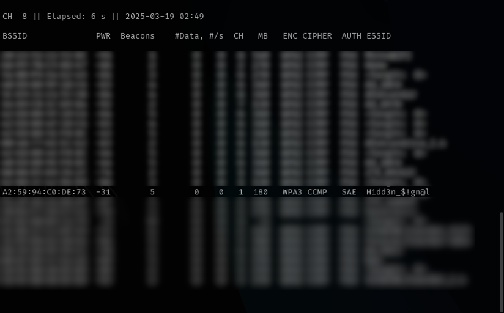
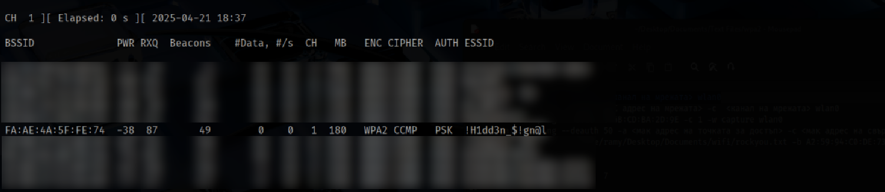
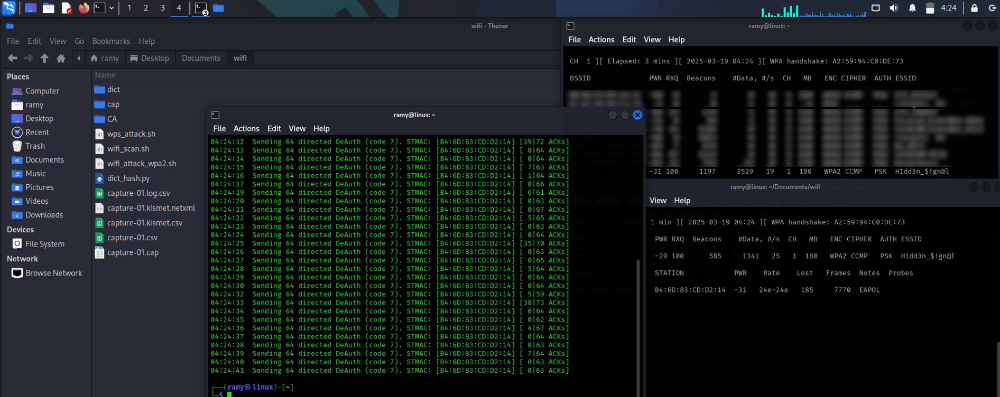
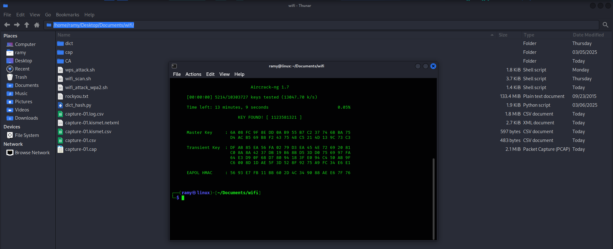
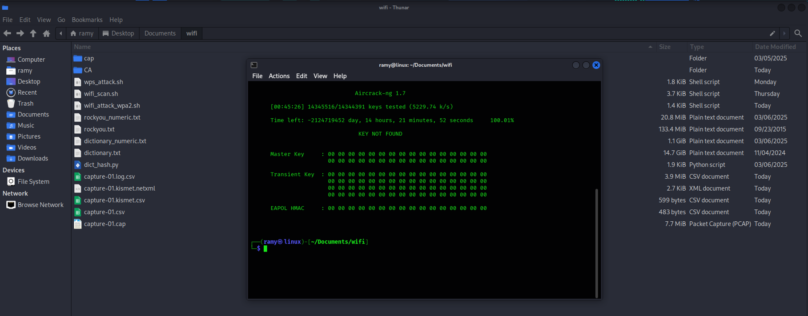

⚠️ **Disclaimer:** This project is strictly for educational purposes only. Do NOT use these tools or techniques on networks you do not own or do not have explicit permission to test. The tests in this project were performed in a controlled environment on a personal network using personal devices.

# 🔓 WPA2 Educational Attack – Capture & Crack

This project demonstrates a dictionary attack on WPA2-protected Wi-Fi networks using ethical hacking techniques in a controlled test environment. It includes two main scripts: one for setting up an Alfa wireless adapter and another for automating the attack process. The project focuses on the well-known vulnerability of WPA2 networks to deauthentication and dictionary attacks. While the attack itself is widely recognized and will only be briefly covered, the primary goal is to explore how it can be optimized and accelerated through scripting and automation.

---

## 🧠 How WPA2 Works and Why It's Vulnerable

WPA2 (Wi-Fi Protected Access II) is a security standard for wireless networks that uses encryption to protect data transmitted between devices (clients) and the router (access point). This encryption uses algorithms like AES (Advanced Encryption Standard), providing a high level of security. When a device (such as a laptop or smartphone) connects to the network, a 4-way handshake takes place. This is a process where the device and the router exchange certain packets to verify that both sides are authentic without directly transmitting the password. The password entered when connecting to the network is not sent in plain text. Instead, it's used to generate a key (the Pairwise Master Key - PMK) that is used to encrypt the traffic. The 4-way handshake process is also used to create this key. After a successful 4-way handshake, communication between the device and the router is encrypted using a dynamically generated key. This secures all the data transmitted over the network.

The key vulnerability of WPA2 is that the 4-way handshake can be intercepted when a device connects to the network. An attacker can listen for these packets and capture them. This allows the attacker to perform an attack later using a dictionary attack to discover the password, without knowing it beforehand. WPA2 is not only vulnerable because of the password but also because an attacker can use a dictionary of possible passwords to perform a brute-force attack on the PMK (the password in hashed form). The ability to use pre-recorded wordlists makes the attack fast and efficient when a handshake has been captured. Many users choose easy-to-guess or common passwords, which makes attacks more successful.

---

## 🔧 Tools Used

- `airmon-ng` – enable monitor mode
- `airodump-ng` – capture packets and handshakes
- `aireplay-ng` – perform deauthentication attacks
- `aircrack-ng` – dictionary attack against captured handshake
- `Python 3` and `Bash` – for scripting and automation

---

## 📝 Scripts

- [Alfa card set up](./scripts/alfa_set.sh)
- [wpa2 attack](./scripts/wifi_attack_wpa2.sh)
- [dictionary hash](./scripts/dictionary_hash.py)

---

Since the vulnerability of WPA2-protected networks has been known for a long time, here's a brief overview of how the attack works before we move on to ideas for optimizing and speeding it up. We will use the network that I created specifically for the experiment: !H1dd3n_$!gn@l

1.Setting up the Alfa card
We can use a script like alfa_set.sh (check the scripts folder), which automatically detects and configures the Alfa Network card. 

2.After that, we use the command "sudo airodump-ng wlan0" to begin monitoring the available networks.

3. Next comes the command "sudo airodump-ng --channel <channel> wlan0", which starts monitoring only the networks on the specified channel.

4. Next comes the command "sudo airodump-ng --bssid <target network MAC address> -c <network channel> wlan0", which starts monitoring only the target network and the devices connected to it.

5. Now we need to capture some traffic. We use the command "sudo airodump-ng --bssid <network mac address> -c <CH> -w capture wlan0" for this.
Once this command is executed, five files named "capture" with differend extensions will be created, in which the traffic will be saved. The file that interests us for the attack is the one with the .cap extension.

6. The moment comes when we need to launch the deauthentication attack. We use the command "sudo aireplay-ng --deauth 50 -a <network mac address> -c <connected device mac address> wlan0". The Alfa card will send 50 packets to the device connected to the access point, specified by its MAC address. This will disconnect the device, and when it attempts to reconnect, we will capture the handshake.

7. Once we successfully capture the handshake, we move on to the final step, which is the dictionary attack. We use the command "sudo aircrack-ng -w /home/<path to dictionary>/rockyou.txt -b <network mac address> capture-01.cap", which will initiate a dictionary attack on the capture.cap file where the handshake is stored.
If the password is found in the dictionary, we will get this output - KEY FOUND - [KEY].

If it is not found in the dictionary, the output will be - KEY NOT FOUND.

This is generally how the attack on WPA2-protected networks works. The questions that arise are "How can we speed up the attack?" and "How can we optimize the chances of success?"

---

## 📝 License

This project is licensed under the MIT License. See [LICENSE](./LICENSE) for more details.

---

## 🙋 About

This repository was created for educational purposes only as part of my cybersecurity learning journey. 
It showcases the knowledge and scripting skills I have gained while studying cybersecurity.
All tools, scripts, and content used in this project are my own work and have been developed as part of my personal learning experience.
