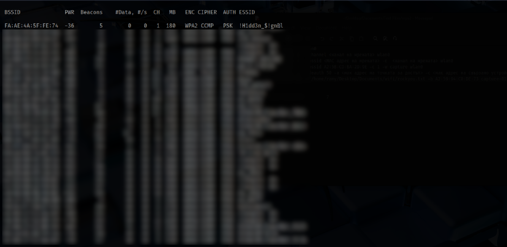

⚠️ **Disclaimer:** This project is strictly for educational purposes only. Do NOT use these tools or techniques on networks you do not own or do not have explicit permission to test. The tests in this project were performed in a controlled environment on a personal network using personal devices.

This project demonstrates a dictionary attack on WPA2-protected Wi-Fi networks using ethical hacking techniques in a controlled test environment. It includes two main scripts: one for setting up an Alfa wireless adapter and another for automating the attack process. The project focuses on the well-known vulnerability of WPA2 networks to deauthentication and dictionary attacks. While the attack itself is widely recognized and will only be briefly covered, the primary goal is to explore how it can be optimized and accelerated through scripting and automation.

---

## 🧠 How WPA2 Works and Why It's Vulnerable

WPA2 (Wi-Fi Protected Access II) is a security standard for wireless networks that uses encryption to protect data transmitted between devices (clients) and the router (access point). This encryption uses algorithms like AES (Advanced Encryption Standard), providing a high level of security. When a device (such as a laptop or smartphone) connects to the network, a 4-way handshake takes place. This is a process where the device and the router exchange certain packets to verify that both sides are authentic without directly transmitting the password. The password entered when connecting to the network is not sent in plain text. Instead, it's used to generate a key (the Pairwise Master Key - PMK) that is used to encrypt the traffic. The 4-way handshake process is also used to create this key. After a successful 4-way handshake, communication between the device and the router is encrypted using a dynamically generated key. This secures all the data transmitted over the network.

The key vulnerability of WPA2 is that the 4-way handshake can be intercepted when a device connects to the network. An attacker can listen for these packets and capture them. This allows the attacker to perform an attack later using a dictionary attack to discover the password, without knowing it beforehand. WPA2 is not only vulnerable because of the password but also because an attacker can use a dictionary of possible passwords to perform a brute-force attack on the PMK (the password in hashed form). The ability to use pre-recorded wordlists makes the attack fast and efficient when a handshake has been captured. Many users choose easy-to-guess or common passwords, which makes attacks more successful.

---

## 🔧 Tools Used

- `airmon-ng` – enable monitor mode
- `airodump-ng` – capture packets and handshakes
- `aireplay-ng` – perform deauthentication attacks
- `aircrack-ng` – dictionary attack against captured handshake
- `Python` and `Bash` – for scripting and automation

---

## 📝 Scripts

- [Alfa card set up](./scripts/alfa_set.sh)
- [wpa2 attack](./scripts/wifi_attack_wpa2.sh)
- [dictionary hash](./scripts/dictionary_hash.py)

---

Since the vulnerability of WPA2-protected networks has been known for a long time, here's a brief overview of how the attack works before we move on to ideas for optimizing and speeding it up. We will use the network that I created specifically for the experiment: !H1dd3n_$!gn@l

1.Setting up the Alfa card
We can use a script like alfa_set.sh (check the scripts folder), which automatically detects and configures the Alfa Network card. 

2.After that, we use the command "sudo airodump-ng wlan0" to begin monitoring the available networks.

3. Next comes the command "sudo airodump-ng --channel <channel> wlan0", which starts monitoring only the networks on the specified channel.

4. Next comes the command "sudo airodump-ng --bssid <target network MAC address> -c <network channel> wlan0", which starts monitoring only the target network and the devices connected to it.

5. Now we need to capture some traffic. We use the command "sudo airodump-ng --bssid <network mac address> -c <CH> -w capture wlan0" for this.
Once this command is executed, five files named "capture" with differend extensions will be created, in which the traffic will be saved. The file that interests us for the attack is the one with the .cap extension.

6. The moment comes when we need to launch the deauthentication attack. We use the command "sudo aireplay-ng --deauth 50 -a <network mac address> -c <connected device mac address> wlan0". The Alfa card will send 50 packets to the device connected to the access point, specified by its MAC address. This will disconnect the device, and when it attempts to reconnect, we will capture the handshake.

7. Once we successfully capture the handshake, we move on to the final step, which is the dictionary attack. We use the command "sudo aircrack-ng -w /home/<path to dictionary>/rockyou.txt -b <network mac address> capture-01.cap", which will initiate a dictionary attack on the capture.cap file where the handshake is stored.
If the password is found in the dictionary, we will get this output - KEY FOUND - [KEY].

If it is not found in the dictionary, the output will be - KEY NOT FOUND.

This is generally how the attack on WPA2-protected networks works. The questions that arise are "How can we speed up the attack?" and "How can we optimize the chances of success?"

## 🚀 How Can We Speed Up the Attack?
The process of network monitoring can be sped up with a script, written in bash or python. A script can be written to automate the process of checking and configuring the Alfa card interface like alfa_set.sh, followed by monitoring the available networks. An additional condition could be added to only display WPA2-protected networks, sort them by signal strength, or show only the information needed for the attack. This combines faster network monitoring with the required information for the attack. 

Once there is information about the network's MAC address and the broadcasting channel, another script can be used to automate the entire attack process, from monitoring the specific network, finding devices to attack through the deauthentication attack, to the dictionary attack. This helps shorten parts of the attack, giving more time for the dictionary attack, as it is the slowest part. Such a script is the wifi_attack_wpa2.sh (see in the scripts folder). It does all of this, requiring only the network interface name, the target network's MAC address, its channel, the capture file name, and the path to the dictionary to be provided. The script performs the entire attack by itself, significantly shortening the time spent typing each command individually and minimizing the chance of making an error in any of them. 

Another way to speed up the attack is to use a GPU instead of a CPU for cracking the password. The aircrack-ng tool uses the CPU to crack the password from the captured handshake. However, this is actually one of the slowest methods. The performance of the aircrack-ng + CPU combination can be improved with a more powerful processor, but there are much more efficient ways to crack the password hash. One of them is using the tool hashcat with a GPU (graphics card). This approach will drastically increase performance and speed up the process. You can even use multiple graphics cards working together. Performance will scale linearly up to a certain point, after which adding more GPUs won’t improve the speed any further. Still, the overall computational power will be significantly greater compared to using CPUs.

Another way to significantly speed up the attack is to pre-hash the password dictionary. A script like dictionary_hash.py(see in scripts folder) can hash the dictionary in advance, which shortens the runtime of aircrack-ng. The reason is that under normal circumstances, the aircrack-ng tool takes one password from the dictionary, hashes it, compares it to the hash of the target password, and if there's no match, it discards it and repeats the process. We can use a script that pre-hashes the dictionary to eliminate this step during the dictionary attack. The dictionary_hash.py script does exactly that, but it requires time and memory to hash the entire dictionary.

## 🎯 How Can We Optimize the Chances of Success?
The main way to increase your chances of success is to manipulate the dictionary. For example, if it's known that the password consists only of characters, a command can be applied to the dictionary to remove all passwords containing digits — or vice versa. Or, if there's reason to believe the password is a string of words from another language, a password dictionary in that language can be downloaded. If the initial reconnaissance phase yields detailed information that could suggest the type of password, a custom dictionary can even be generated based on that. For instance, if we know the network owner is a doctor, we could generate a dictionary containing many medical-related terms or words in Latin.
When working with dictionary manipulation, it's a good idea to maintain a collection of dictionaries tailored for different purposes and scenarios. Multiple dictionaries can be downloaded, some of the above manipulations can be applied, and then they can be merged into a single one, with a command run to remove any duplicate passwords.

## 🛡️ Methods for Protecting Against WPA2 Attacks
There are various methods by which we can protect ourselves from attacks against WPA2. Naturally, the ways to secure our networks differ slightly depending on whether we’re using a smartphone hotspot for internet access in public places, for example, or a home network where we typically use a router that broadcasts the network signal. But generally speaking, the most significant improvement in network security comes from choosing a strong and complex password, and opting for WPA3 instead of WPA2.

WPA3 is a newer standard than WPA2, and although some vulnerabilities have already been discovered in it, it remains significantly more secure than its predecessor. It offers protection against deauthentication and dictionary attacks.

As for choosing a strong and complex password — this is always a good approach, regardless of whether we're talking about securing a network, an account, a website, a blog, or any other type of system. As we saw with dictionary attacks, dictionaries can contain massive numbers of passwords, some generated and others leaked from old databases. Therefore, when selecting a password, it’s wise for users to come up with one that is long and complex — containing letters, numbers, and special characters — in order to make it as difficult as possible for an attacker and their dictionary.

Of course, there are other protection measures against WPA2 vulnerabilities, such as disabling automatic probe requests, enabling MAC address filtering, turning off WPS, hiding the SSID (network name), or limiting the number of connected devices. These are also forms of protection, but in my opinion, choosing a more secure network protocol and using a strong password are by far the most reliable and secure methods.

---

## 📝 License

This project is licensed under the MIT License. See [LICENSE](./LICENSE) for more details.

---

## 🙋 About

This repository was created for educational purposes only as part of my cybersecurity learning. 
It showcases the knowledge and scripting skills I have gained while studying cybersecurity.
All tools, scripts, and content used in this project are my own work and have been developed as part of my personal learning experience.
